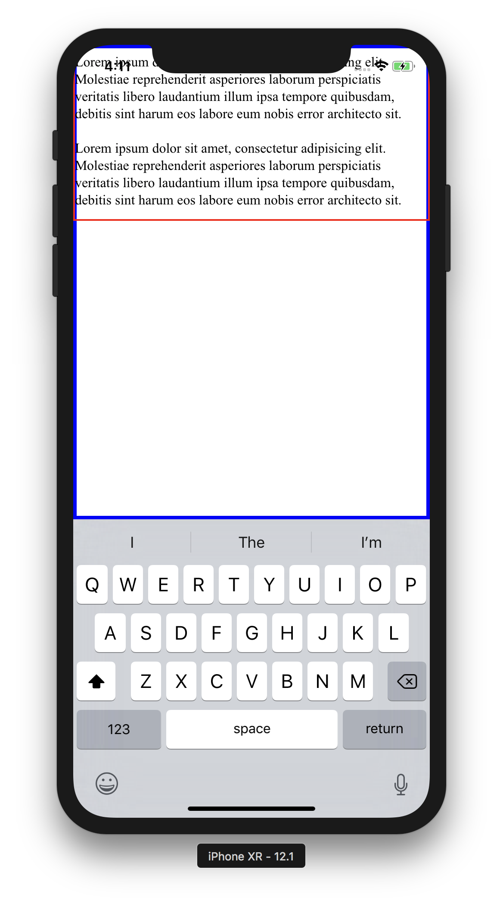

## React Native WebView Resize Bug

This app shows an html webpage inside a webview that resizes when the keyboard opens.

When you focus on the `<input/>` element, the keyboard will open and wehen you click the `<button/>`, the keyboard will dismiss.

**You will notice that when editing an input that is lower in the keybaord, the entire body to gets moved up outside of the webview frame in an undesireable fashion.**



## Running the app

```sh
git clone https://github.com/ccorcos/react-native-demo.git
cd react-native-demo
git checkout resize-bug-2
npm install
# Server the index.html file
python -m SimpleHTTPServer 8000
# Start react native
npm start
# Open Xcode and run the app.
open ios/chetapp.xcodeproj
```